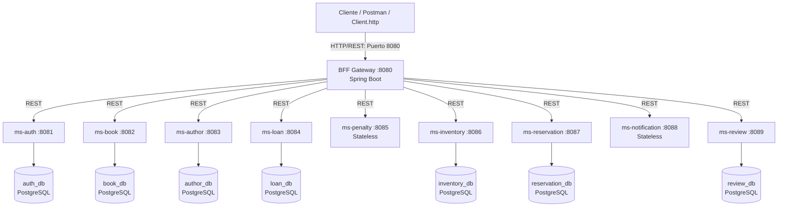
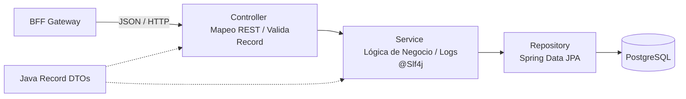

# Sistema de Biblioteca - Arquitectura de Microservicios

Este repositorio implementa una solución completa para la gestión de una biblioteca digital, utilizando una arquitectura desacoplada basada en microservicios y un portal de orquestación centralizado bajo el patrón **BFF (Backend for Frontend)**.

---

## 🏛️ Arquitectura del Sistema (C4 Model)

### 1. Nivel C2: Contenedores (Software Pieces)
El nivel C2 detalla las diferentes piezas de software ejecutables que componen el sistema, sus tecnologías y bases de datos aisladas:



### 2. Nivel C3: Componentes de un Microservicio
El nivel C3 describe la estructura interna estándar de cada uno de los microservicios, asegurando la separación de responsabilidades en capas:



---

## 🛠️ Detalle de las Capas e Inmutabilidad
* **Capa Controller**: Expone las rutas de cada entidad. Es responsable de recibir la petición HTTP y validar los payloads inmutables.
* **Capa Service**: Implementa la lógica de negocio y encapsula la escritura de logs mediante `@Slf4j`. Todos los comentarios siguen el estándar JavaDoc (`/** ... */`) en español.
* **Java Records (DTOs)**: Todo el transporte de datos se realiza a través de records inmutables, previniendo alteraciones de datos accidentales en tránsito.

---

## ⚙️ Requisitos Previos e Instalación

### Requisitos:
* **Java**: JDK 25 instalado.
* **Docker y Docker Desktop** instalados y activos.

### Pasos para iniciar el sistema:

1. **Compilar los JARs de forma nativa**:
   ```powershell
   # Ejecutar en la raíz para compilar todos los proyectos
   python -c "import subprocess, os; [subprocess.run('.\gradlew.bat clean bootJar -x test', shell=True, cwd=os.path.join(os.getcwd(), s), check=True) for s in ['bff', 'ms-auth', 'ms-book', 'ms-author', 'ms-loan', 'ms-penalty', 'ms-inventory', 'ms-reservation', 'ms-notification', 'ms-review']]"
   ```

2. **Levantar los servicios con Docker Compose**:
   ```bash
   docker compose up -d --build
   ```

3. **Verificar estado de contenedores**:
   ```bash
   docker compose ps
   ```

---

## 📖 Documentación Interactiva (Swagger)
El Swagger de documentación está disponible a través de la interfaz del BFF:
* **URL**: [http://localhost:8080/swagger-ui/index.html](http://localhost:8080/swagger-ui/index.html)
